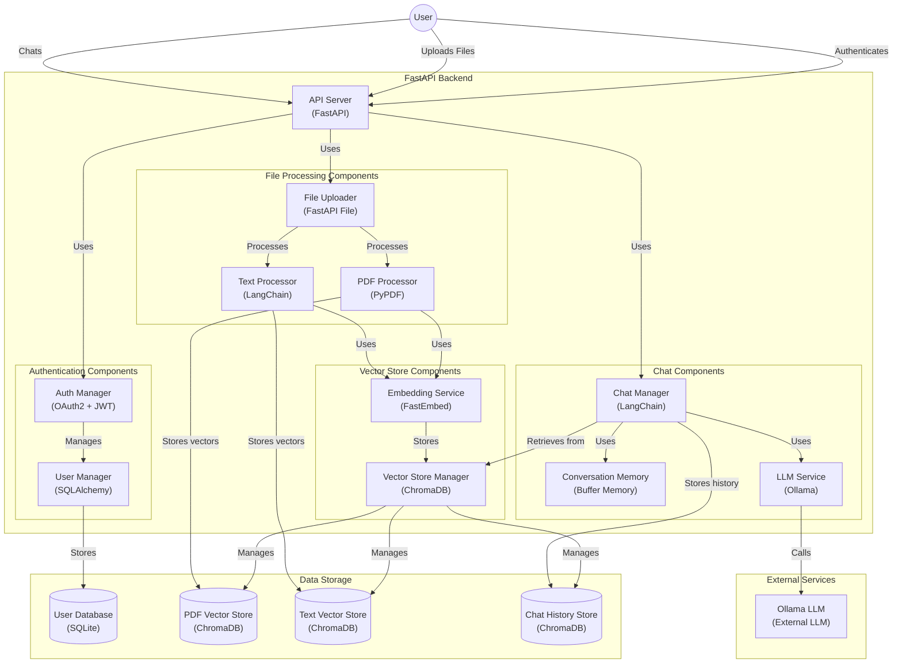

# Edge AI


## Description
This is a prototype of an edge cloud system specializing in AI, designed to empower businesses utilizing LangChain. It facilitates the creation of Retrieval Augmented Generation (RAG) AI models trained exclusively on a company's or organization's proprietary data.

## Tools used in this project
* [LangChain](https://www.langchain.com/): LangChain is a software framework that helps facilitate the integration of large language models (LLMs) into applications.
* [Ollama](https://ollama.com/): Ollama is an advanced AI tool that enables users to run large language models (LLMs) locally on their personal computers.
* [FastApi](https://fastapi.tiangolo.com/): astAPI is a modern, fast (high-performance), web framework for building APIs with Python based on standard Python type hints.
* [Llama3.1](https://www.llama.com/llama3.1/): LLM model

## Project Structure

- **api/**: Contains the main FastAPI application file ([`app.py`](api/app.py)).
- **src/**: Contains modules for data processing, file uploading, and chat.
- **Dockerfile**: Defines the Docker container configuration.
- **requirements.txt**: List of project dependencies.
- **Readme.md**: Project description and how to run it.
- **.gitignore**: Files and directories to be ignored by Git.

## File Descriptions

### [`api/app.py`](api/app.py)

This file defines the FastAPI application with several endpoints:

1. **`/text/`**: Processes and stores text in a vectorstore.
2. **`/upload/`**: Uploads a PDF file, processes it, and stores it in a vectorstore.
3. **`/chat/`**: Generates a response to a message using a language model and a vectorstore.
4. **`/delete-pdf/`**: Deletes a PDF file from the vectorstore.

### [`src/upload_files.py`](src/upload_files.py)

This module contains functions for processing PDF files, creating vectorstores, sanitizing file names, and deleting PDF files from the server and the vectorstore.

### [`src/chat.py`](src/chat.py)

This module defines the [`chat`](src/chat.py) function that generates responses to messages using a language model and a vectorstore. It uses conversation memory to maintain the context of the conversation.

### [`src/get_data.py`](src/get_data.py)

This module contains the [`process_and_store_text_data`](src/get_data.py) function that processes and stores text in a vectorstore.

## Project Functionality

1. **Text Processing**: The `/text/` endpoint receives text and optional metadata, processes it, and stores it in a vectorstore using embeddings generated by the [`FastEmbedEmbeddings`](api/app.py) model.

2. **PDF File Upload**: The `/upload/` endpoint allows uploading PDF files. The files are processed and stored in a vectorstore. Embeddings are generated for the documents extracted from the PDF.

3. **Chat**: The `/chat/` endpoint allows users to send messages and receive responses generated by a language model. It uses an [`EnsembleRetriever`](src/chat.py) to combine text and PDF data in the responses.

4. **PDF File Deletion**: The `/delete-pdf/` endpoint allows deleting PDF files from the vectorstore and the server.

## Handling Multiple Users

The project handles multiple users as follows:

1. **Conversation Memory**: Uses [`ConversationBufferMemory`](src/chat.py) to maintain the context of each user's conversation. The memory can be reset if the user requests it.

2. **Separate Vectorstores**: Uses different vectorstores to store text and PDF data, allowing efficient information retrieval.

3. **Independent Endpoints**: Each endpoint is independent and can handle concurrent requests from multiple users thanks to the asynchronous nature of FastAPI.

4. **Authentication and Security**: Although not explicitly mentioned in the provided code, it is recommended to implement authentication and authorization to ensure that each user's data is protected and accessible only by the corresponding user.

## Running the Project

To run the project, you can use Docker:

1. **Build the Docker Image**:
    ```bash
    docker build -t my-fastapi-app .
    ```

2. **Run the Docker Container**:
    ```bash
    docker run -p 5000:5000 my-fastapi-app
    ```

This will expose the application on port 5000, allowing users to interact with the defined endpoints.

In summary, this project uses FastAPI to create an API that allows processing and storing text and PDF data, generating responses to messages, and handling multiple users through conversation memory and separate vectorstores.